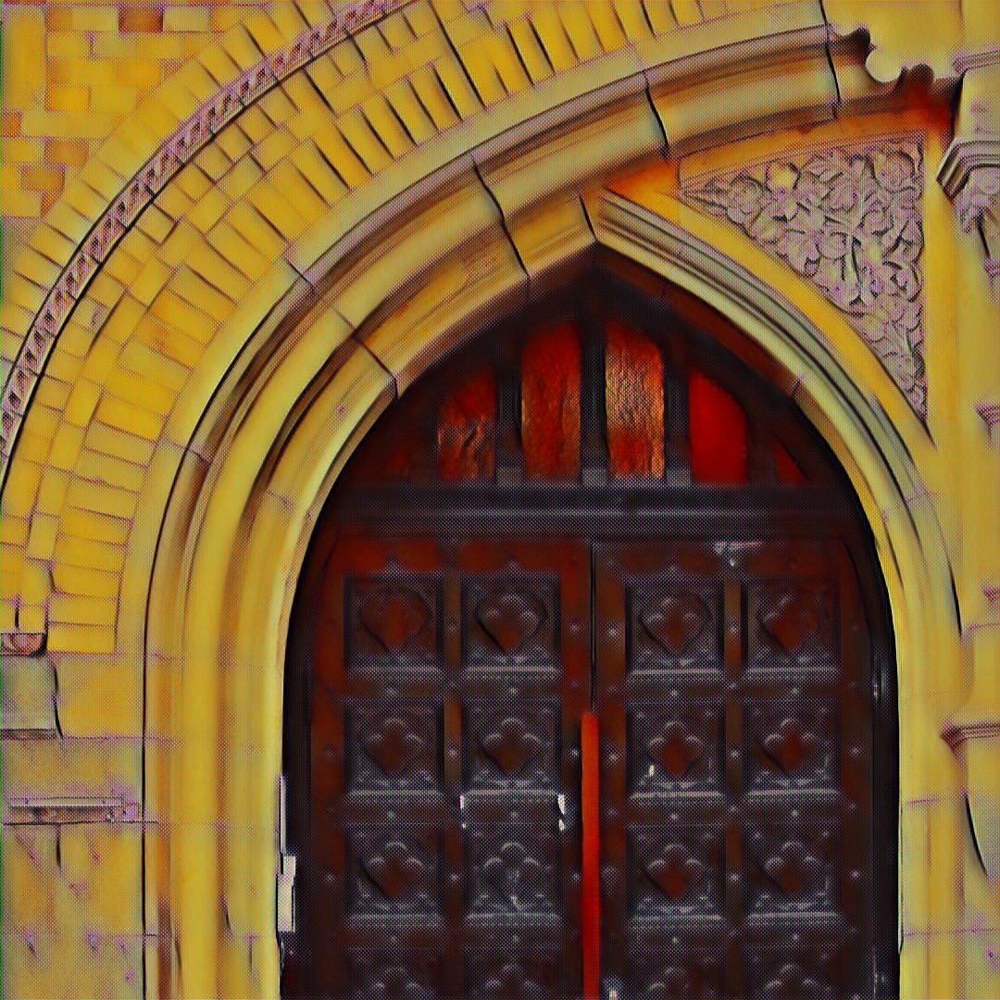
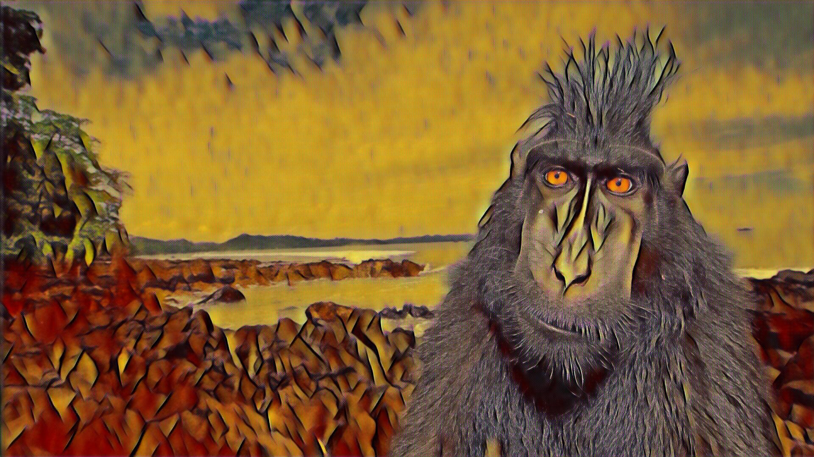
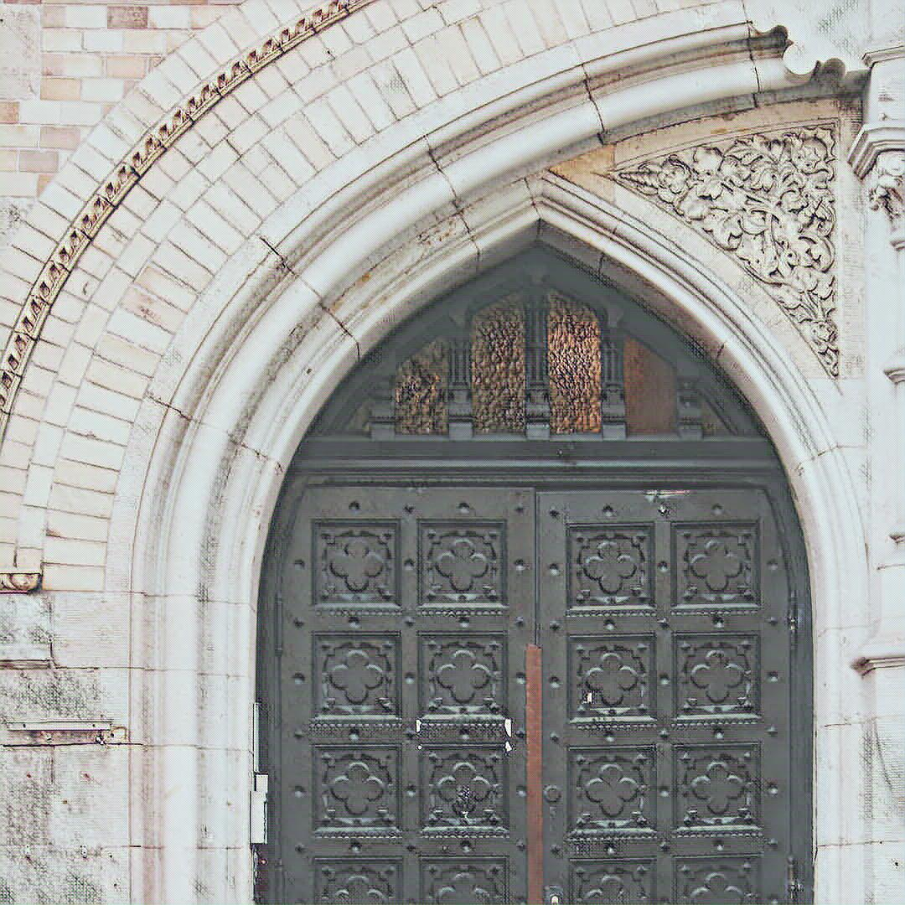
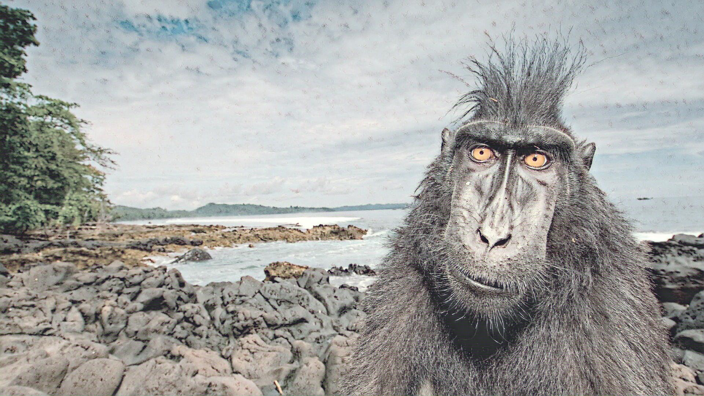
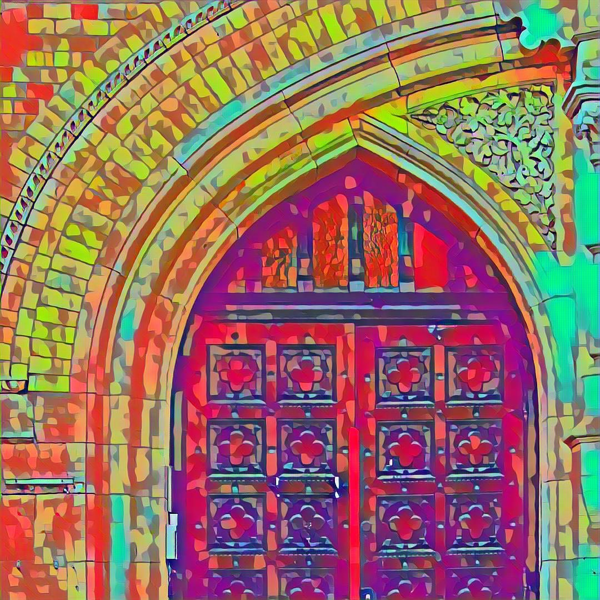
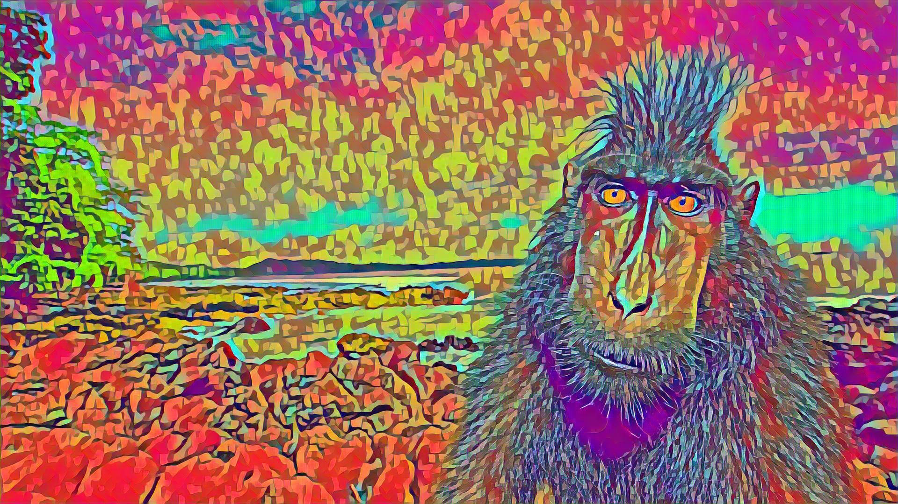
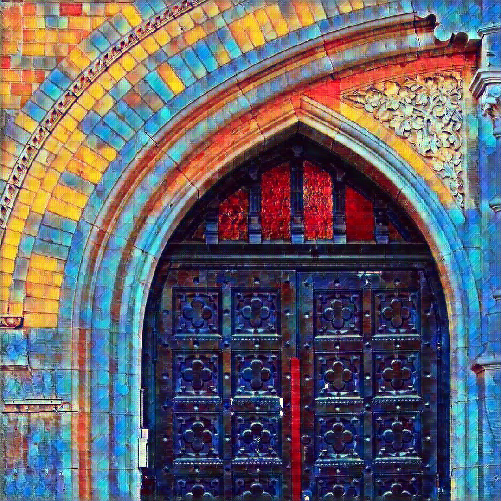
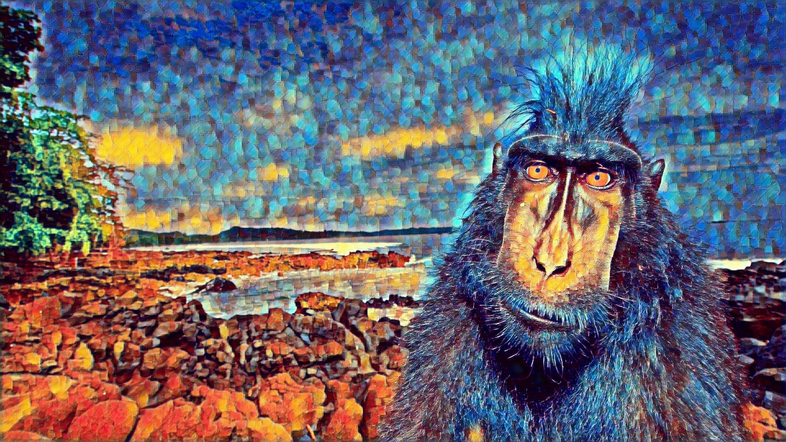

# Neural Style Transfer

## 📌 Project Overview

This project explores neural style transfer — the process of applying the artistic style of one image to the content of another. Inspired by the work of Johnson et al. (2016), we implement and compare three types of image transformation networks: a baseline transformer network, a DenseNet-based model, and a ResNeXt-based model. The goal is to assess training time, image quality, and perceptual loss across these architectures.

---

## 📚 Datasets

- **Training Data**: A 2,000-image subset of the 2014 COCO dataset (resized to 256×256).
- **Content Images**: Photographs of varied scenes (e.g., a door, a monkey, Joshua Tree National Park).
- **Style Images**: Artworks spanning cubism, impressionism, modern, and traditional Chinese styles.

---

## 🏗️ Model Architecture

Each model consists of:
- An **image transformation network** (Transformer, DenseNet, or ResNeXt)
- A fixed **loss network** (VGG16 pretrained on ImageNet)

Key components:
- **Instance normalization** (instead of batch normalization)
- **Upsampling** layers to replace deconvolutions
- **Perceptual loss**:
  - Content loss: Feature reconstruction error (from VGG)
  - Style loss: Frobenius norm between Gram matrices of style features

---

## 📊 Evaluation

- **Training Time**:
  - Transformer: ~63 min/epoch
  - DenseNet: ~53.5 min/epoch
  - ResNeXt: ~60 min/epoch
- **Loss Comparison**:
  - ResNeXt showed the lowest overall perceptual loss.
  - DenseNet and ResNeXt performed similarly in terms of content/style loss curves.
- **Qualitative Findings**:
  - Transformer network produced visually richer details for colorful style images.
  - All models generated realistic stylizations that preserve structural content.

---

## 🖼️ Sample Results

Below are stylized output examples from different style images applied to the same content images.

### 🎨 Style 1 (`result/pic/`)

| Amber | Monkey |
|-------|--------|
|  |  |

### 🎨 Style 2 (`result/pic2/`)

| Amber | Monkey |
|-------|--------|
|  |  |

### 🎨 Style 3 (`result/pic3/`)

| Amber | Monkey |
|-------|--------|
|  |  |

### 🎨 Style 4 (`result/pic4/`)

| Amber | Monkey |
|-------|--------|
|  |  |


---

## ▶️ Install Dependencies

```bash
pip install torch torchvision numpy matplotlib
